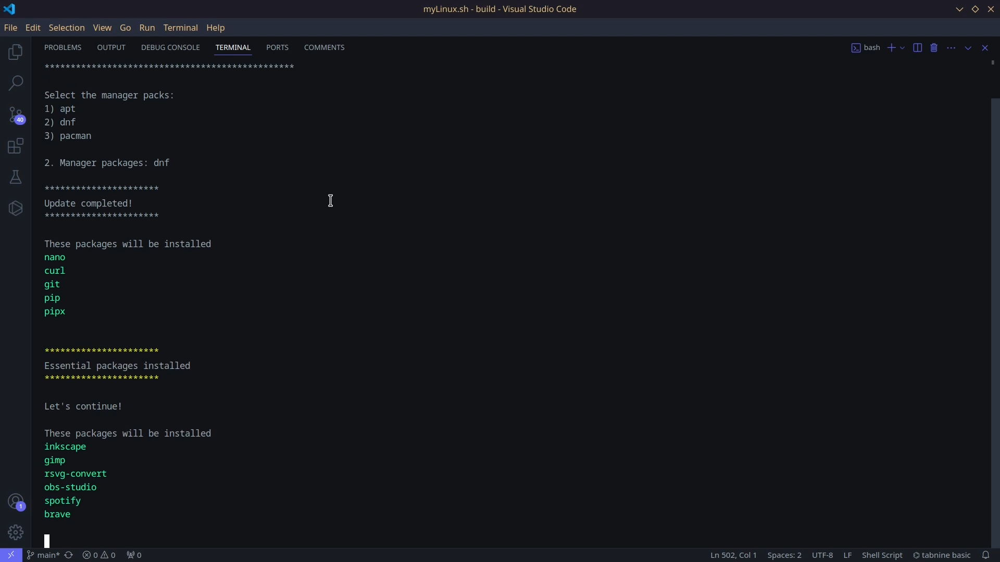

## Description:
- Streamline your Linux setup with myLinux, a user-friendly script that automates package installation and configuration across various distributions (Debian, RHEL, Arch).
- Save time and effort by installing essential tools, development environments, multimedia applications, and scientific software with a single command.
- Stay organized with pre-defined package groups (essentials, media, scientific, etc.) and a detailed installation log.
- Customize your experience by easily modifying package selections and configurations.

## Motivation:
- Eliminate the need to remember lengthy installation commands and configurations.
- Reduce the frustration of searching forums for solutions you've already found.
- Achieve a consistent setup across multiple Linux installations.

## Getting Started:

1. Clone the Repository: 
```bash
git clone https://github.com/your-username/myLinux.git
```

2. Navigate to the Directory:
```bash
cd myLinux
```
3. Run the Script:
```bash
./myLinux.sh
```



## Installation Options:

- **Essentials**: Core utilities, editors, terminals.
- **Media**: Multimedia applications, image/video editors.
- **Scientific**: Development tools, scientific computing packages.
- **Manim**: Create beautiful mathematical animations (optional dependencies mentioned).
- **Terminal**: Enhanced shell experience with plugins (additional configuration steps).
- **Git** Configuration (Optional): Set up your Git username and email.


### Customization:
Review and modify package lists in the build_packs, midia_packs, scientific_packs, manim_packs, and terminal_packs arrays within the script.

### Additional Notes:
- The script handles package dependencies automatically.
- Refer to the install.log file for detailed installation information.
- Manual configuration steps for certain applications might be necessary (instructions provided in manual.md).

### Contributing:
We welcome contributions to improve myLinux. Feel free to submit pull requests that enhance functionality, fix bugs, or add new features. Please follow the standard Git workflow and collaboration guidelines.

Enjoy a seamless and customized Linux setup experience with myLinux!